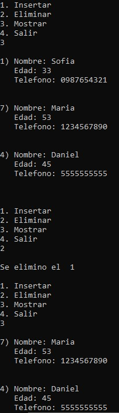

# Linked List Stack Records

A dynamic stack implementation using linked nodes in C for managing structured records.

## Overview

This project demonstrates the implementation of a stack data structure using dynamically allocated linked nodes.

Unlike array-based stacks, this implementation uses linked memory allocation, allowing each element to be stored independently as a node.

Each stack element contains a complete record with an ID, name, age, and phone number.

The project demonstrates the Last In, First Out (LIFO) behavior through Push and Pop operations.

## Features

- Dynamic stack implementation.
- Linked node structure.
- Push operation for inserting records.
- Pop operation for removing records.
- Display stack contents.
- Dynamic memory allocation.
- Record management.

## Screenshot



## Technologies

- C
- Standard C Library
- Dev-C++

## Project Structure

```text
.
├── assets
│   └── images
│       └── linked_list_stack_records_demo.jpg
├── linked_list_stack_records.cpp
├── README.md
├── LICENSE
└── .gitignore
```

## How to Compile

Using GCC:

```bash
g++ linked_list_stack_records.cpp -o linked_list_stack_records
```

## How to Run

Windows:

```bash
linked_list_stack_records.exe
```

Linux/macOS:

```bash
./linked_list_stack_records
```

## Concepts Demonstrated

- Stack data structure
- LIFO principle
- Linked lists
- Dynamic memory allocation
- Structures (`struct`)
- Pointers
- Node management
- Push and Pop operations

## Future Improvements

- Add stack size tracking.
- Add search functionality.
- Validate input data.
- Improve memory cleanup before program termination.
- Separate implementation into header and source files.

## License

This project is licensed under the MIT License.

## Author

Luis Alva
